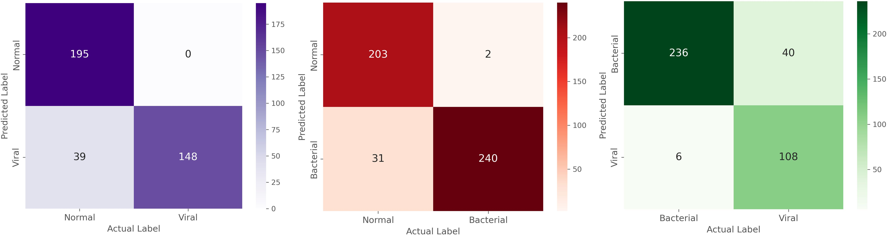
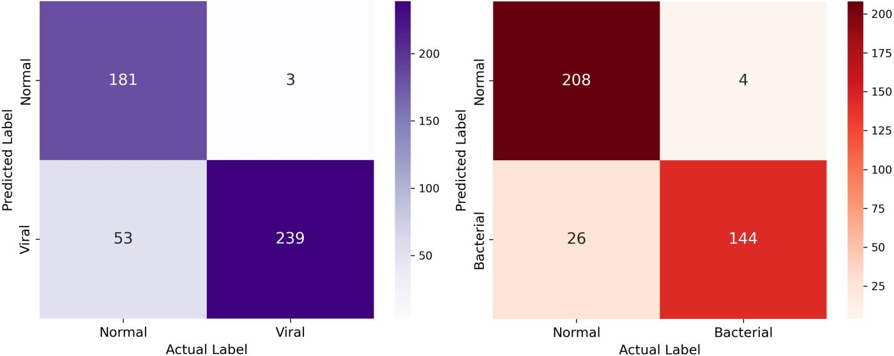
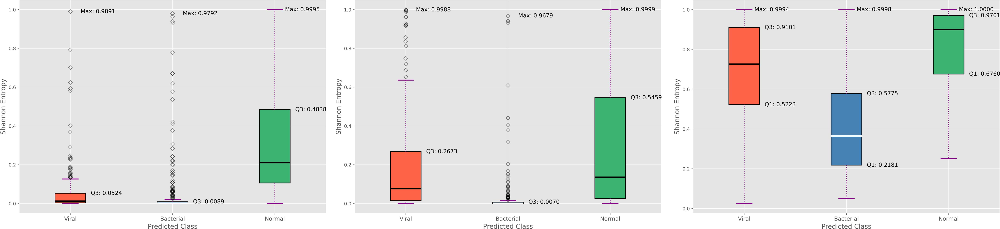

# Hallucinations-in-Binary-Chest-X-ray-Pneumonia-Classification

Hallucination in deep learning (DL) classification, where DL models yield confidently erroneous predictions remains a pressing concern. This study investigates whether binary classifiers are truly learning disease-specific features when distinguishing overlapping radiological presentations among pneumonia subtypes on chest X-ray (CXR) images. Specifically, we evaluate if uncertainty measure is a valuable tool in classifying signs of different pathogen-specific subtypes of pneumonia. We evaluated two binary classifiers to classify bacterial pneumonia and viral pneumonia, respectively, from normal CXRs. A third classifier explored the ability to distinguish bacterial from viral pneumonia presentation to highlight our concern regarding the observed hallucinations in the former cases. Our comprehensive analysis computes the Matthews Correlation Coefficient and prediction entropy metrics on a pediatric CXR dataset and reveals that the normal/bacterial and normal/viral classifiers consistently and confidently misclassify the unseen pneumonia subtype to their respective disease class. These findings expose a critical limitation concerning the tendency of binary classifiers to hallucinate by relying on general pneumonia indicators rather than pathogen-specific patterns, thereby challenging their utility in clinical workflows.

# Requirements

The Jupyter notebook "entropy_analysis.ipynb" uses the following package versions:

1. Tensorflow version 2.17.0
2. scikit_optimize 0.10.2
3. opencv-python-headless 4.11.0.86
4. umap_learn 0.5.7
5. openpyxl 3.1.5
6. seaborn 0.13.2
7. matplotlib 3.10.1 

# Dataset

The pediatric chest X-ray dataset published by Kermany, Daniel; Zhang, Kang; Goldbaum, Michael (2018), “Labeled Optical Coherence Tomography (OCT) and Chest X-Ray Images for Classification”, Mendeley Data, V2, doi: 10.17632/rscbjbr9sj.2. This dataset contains 5,856 frontal CXR images of children (ages 1–5), collected from Guangzhou Women and Children’s Medical Center, China. The CXR images are categorized into three classes: (i) showing normal lungs, (ii) bacterial pneumonia, or (iii) viral pneumonia. No other clinical metadata is provided.

# Preprocessing Methods

The CXRs were preprocessed to help the models focus on the lung regions and ensure consistent input size: (i) An in-house YOLOv8 detection model was used to detect and crop the lung fields from each CXR. This process helps exclude irrelevant regions so the model could learn from the pulmonary parenchyma where pneumonia manifests; (ii) Cropped lung images were resized to a height and width of 168 pixels and 224 pixels, respectively, (a resolution chosen to balance detail and computational efficiency) and to match the average aspect ratio of the original CXRs (the ratio of height to width is 1:1.33). Pixel intensity values were normalized to a standard range (0–1) to facilitate model convergence. The Kermany et al. study that published the pediatric data suffer from the limitation of optimizing the model on the hold-out test set, thereby creating a learning bias. To avoid this bias, while we used the official hold-out test set published by Kermany et al., but the training set was further split into 80/20 for training and validation, respectively, on a patient level, ensuring images from a given patient appear in only one of these sets, thereby preventing information leakage. This learning strategy helps avoid overly optimistic performance by optimizing the model on the hold-out test set. 

# Model Architecture

We trained three binary CXR classifiers: (i) A normal/bacterial classifier to classify CXRs as showing normal lungs or bacterial pneumonia, (ii) a normal/viral classifier to classify CXRs as showing normal lungs or viral pneumonia, and (iii) a bacterial/viral classifier trained to distinguish bacterial pneumonia from viral pneumonia. All models share the VGG-16 backbone, a widely used architecture for medical imaging due to its moderate size and proven performance with CXR classification tasks. The models were truncated at the final pooling layer and added with global average pooling and dense Softmax layers for classification. Training followed a transfer-learning approach, using an ImageNet-pretrained VGG-16, optimized with Adam (initial learning rate: 1×10⁻⁴) and categorical cross-entropy loss. The mini-batch size was set to 32, with early stopping (patience: 10 epochs) to prevent overfitting. If validation loss plateaued, the learning rate was reduced by 0.1 (minimum: 1×10⁻⁵). Models were trained for up to 64 epochs, typically converging within 20–30 epochs. To address dataset imbalance (bacterial cases outnumbered normal and viral cases ~2:1), class weights inversely proportional to class frequencies were applied to prevent bias toward bacterial predictions. Models were trained on AWS SageMaker (EC2 G5 instance, NVIDIA A10G Tensor Core GPU, 24GB memory) using TensorFlow Keras with CUDA acceleration.

# Prediction Entropy Analysis
We used Shannon entropy to compute prediction uncertainty in the binary classifiers. Shannon entropy, also called information entropy, quantifies the uncertainty in a probability distribution. It is important to note that here we refer exclusively to information entropy, not thermodynamic entropy, which is used in physics and chemistry. For the normal/bacterial and normal/viral classifiers, for each test image, the model assigns a probability 𝑝 to the pneumonia class and 1−𝑝 to the normal class. The entropy 𝐻(𝑝) is computed as 𝐻(𝑝)=−[𝑝𝑙𝑜𝑔(𝑝)+(1−𝑝)log(1−𝑝)]. For the bacterial/viral classifier, for each test image, the model assigns a probability 𝑝 to the viral pneumonia class and 1−𝑝 to the bacterial pneumonia class. Lower entropy values indicate higher confidence in the prediction, while values approaching 1 bit (which occur when 𝑝 = 0.5) reflects greater uncertainty. Ideally, the class on which the model is trained should yield low entropy upon correct classification, signifying confident predictions. Conversely, disease samples that the model is not trained on (OOD) upon “correct” disease classification should result in higher entropy values, indicating greater uncertainty even though it is (obviously) not of the specific disease subtype. However, if the entropy remains low for OOD disease samples, it suggests that the model is overconfident in its hallucinated prediction. To further characterize prediction uncertainty (entropy) values, we computed key statistical measures from their distribution: (i) the first quartile (Q1), (ii) the second quartile (Q2, or median), (iii) the third quartile (Q3), and (iv) the interquartile range (IQR = Q3 – Q1). Q1 represents the lower boundary of the lowest 25% of entropy values (low uncertainty region), Q2 provides the median value of prediction uncertainty, and Q3 represents the upper boundary for the middle 75% of values (indicating higher uncertainty). The IQR metric provides a robust measure of variability in the central portion of the data. A smaller IQR implies consistent uncertainty across predictions, whereas larger values indicate greater variability (spread) in the model’s confidence. We computed and compared the Wilson confidence interval (CI) for the IQR metric to assess the significance of its variation across in-distribution (the samples on which the models were trained) and OOD samples.

# Results

**Figure 1:** Confusion matrices for (left) normal/viral classifier, (middle) normal/bacterial classifier, and (right) bacterial/viral classifier.

**Figure 2:** Confusion matrices for OOD classification. (left) normal/viral classifier predicting bacterial test samples as belonging to viral, and (right) normal/bacterial classifier predicting viral test samples as belonging to bacterial.

**Figure 3:** Bar plots showing entropy values. (Left) Normal/Viral classifier, (Middle) Normal/Bacterial classifier, and (Right) Bacterial/Viral classifier.

Analyzing the entropy statistics for the in-distribution and OOD predictions of the classifiers offered insights into model uncertainty. For the normal/viral classifier, the in-distribution IQR was 0.0494 (CI: [0.0285, 0.0845]), while the OOD IQR was 0.0082 (CI: [0.0022, 0.0295]). The 𝑧-score ≈ 2.556, which corresponded to a 𝑝 value ≈ 0.0105. indicates that the in-distribution and OOD prediction uncertainties were statistically significant. Although this difference is significant, we interpreted them in the context of classification performance. Specifically, the normal/viral model exhibited a narrower IQR on OOD samples indicating consistent OOD prediction uncertainty. Together with comparable or even superior MCC performance on OOD samples relative to in-distribution samples, the results suggest that the model’s learned feature space captured broad pneumonia-related characteristics. For the normal/bacterial classifier, the in-distribution IQR was 0.0068 (CI: [0.0017, 0.0274]), and the OOD IQR was 0.2529 (CI: [0.1897, 0.3286]). The resulting 𝑧-score ≈ 6.78 yielded a 𝑝 value<0.0001. This highly significant difference revealed that the normal/bacterial classifier exhibited markedly higher uncertainty (larger IQR) when forced to label viral CXRs as bacterial, consistent with the observed drop in classification performance on OOD viral data (see Table IV). Since the bacterial/viral classifier is trained on both diseases there is no “unseen” OOD data. However, the IQR values, 0.3878 for viral (CI: [0.3131, 0.4682]) and 0.3594 for bacterial (CI: [0.3016, 0.4216]) respectively, indicated moderate to high entropy when discriminating between them.This was evident from the computed 𝑧-score ≈ 0.58, resulting in a 𝑝 value ≈ 0.56, indicating the classifier’s uncertainty is similar between bacterial and viral cases, reflecting the inherent challenge of differentiating between two pneumonia subtypes with overlapping radiological features.

# Conclusion

This study exposes a fundamental limitation of binary classification models. Under the closed-world assumption, these models assign OOD samples from an unseen disease subtype to their learned disease class with high certainty when it has a similar presentation to learned disease class. Such overconfident misclassifications raise serious concerns regarding clinical utility, as they can lead to unreliable predictions resulting in potentially incorrect diagnoses and inappropriate treatment decisions. For example, many pneumonia patients, especially early in the disease, can have normal or near-normal chest radiographs. Additionally, both bacterial and viral cases of pneumonia not only coexist but may also present with similar patterns in early disease. Further, CXRs do not have sufficient diagnostic accuracy to confidently distinguish between these infectious causes, where clinical cues and ancillary tests remain essential to guide treatment decisions. Therefore, relying solely on an imaging classifier that dichotomizes “normal” versus “infected” (whether bacterial or viral) oversimplifies a complex diagnostic challenge. To overcome these limitations, rather than just binary models, future research should focus on multimodal learning. Employing anomaly detection techniques could aid in atypical case detection, thereby reducing misclassification rates. Uncertainty-aware architectures, such as Bayesian neural networks or those incorporating Monte Carlo dropout methods, can help detect low-certainty in predictions and enhance model interpretability. Further visualizing the learned behavior using class activation methods like Grad-CAM and Class-Selective Relevance Mapping could be used to verify that the activations highlight the disease-specific regions. Training models explicitly for OOD detection and integrating clinical metadata could further improve the robustness and clinical applicability of AI-driven diagnostic systems.
